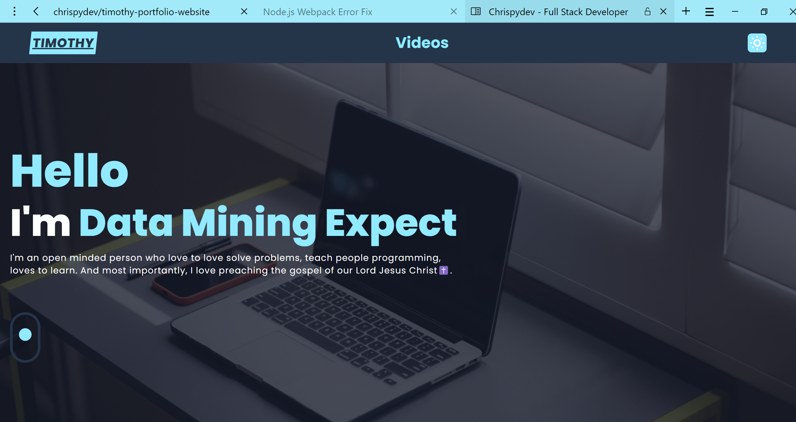

## This is my personal website built with next.js



Link to my website [https://chrispydev.vercel.app/](https://chrispydev.vercel.app/)

## Getting Started

First, install dependencies and run the development server:

```bash
yarn && yarn dev
# or
npm i && npm run dev
```

Open [http://localhost:7777](http://localhost:3000) with your browser to see the results.
